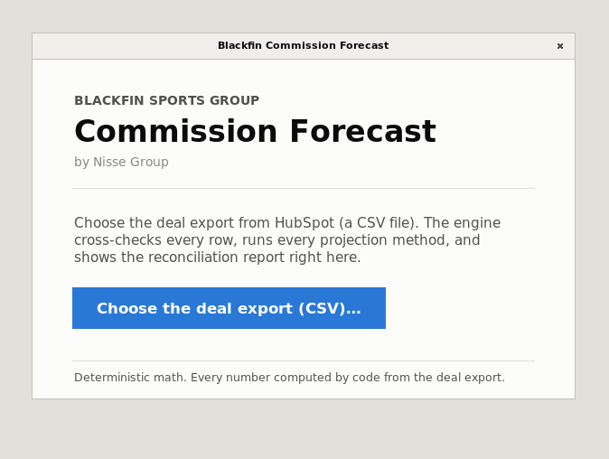
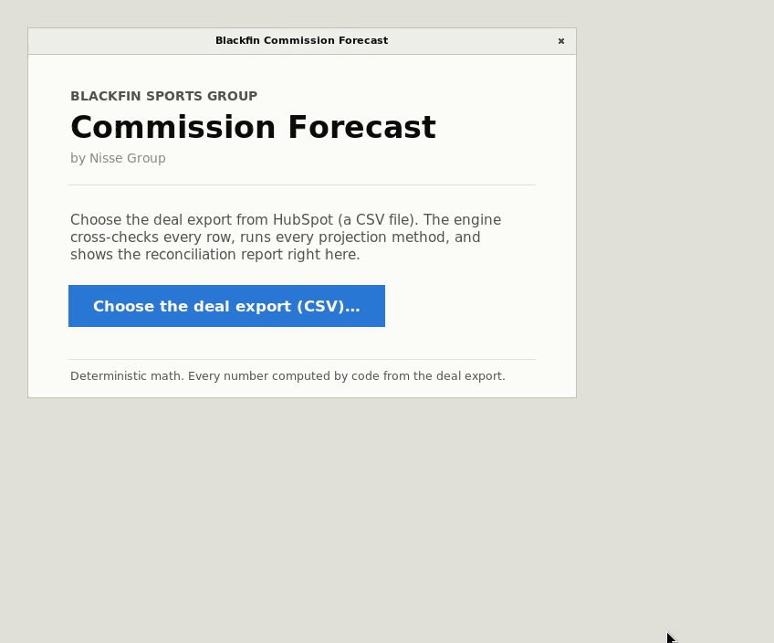
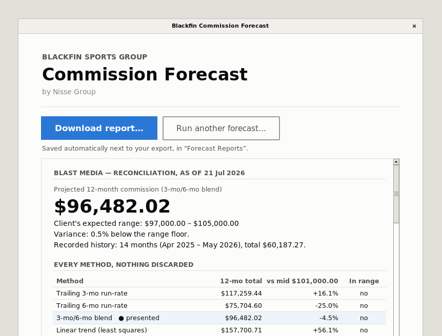
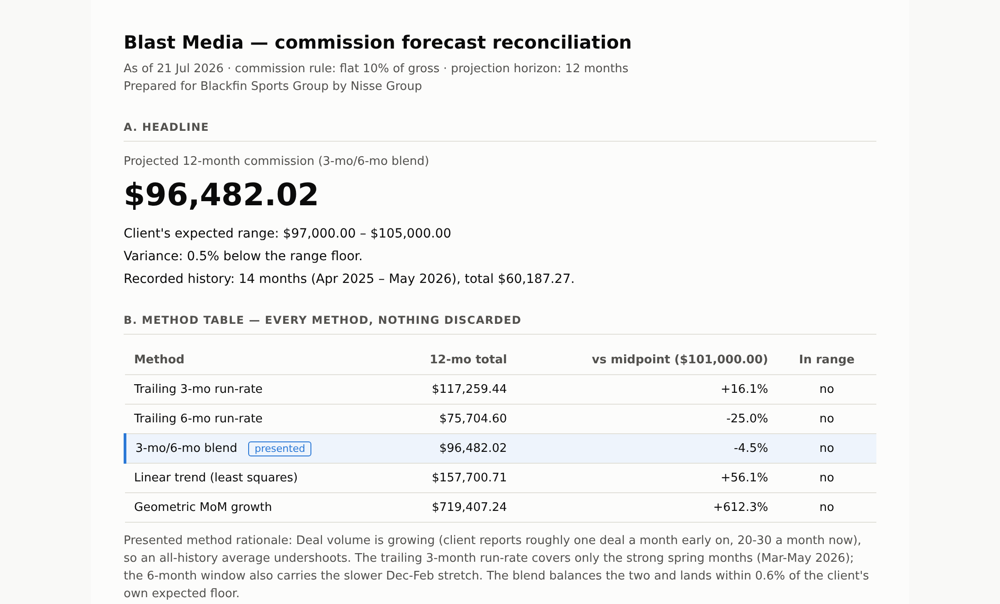
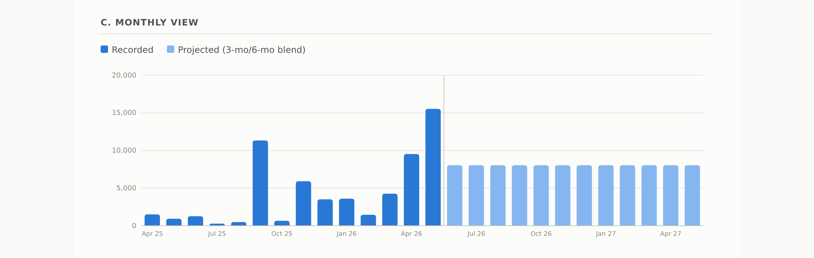
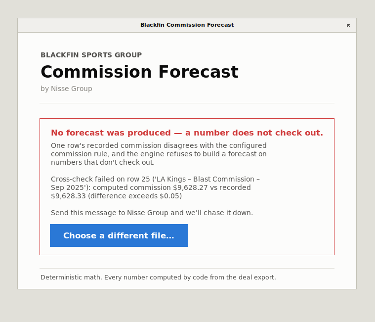

# Blackfin commission engine

Deterministic commission-revenue forecasting for Blackfin Sports Group,
built by Nisse Group. Reads a structured deal export, applies the client's
commission rule, and produces a reconciliation report: our computed numbers
beside the client's known numbers, with variance, so every figure can be
checked by hand.

New here? `HANDOFF.md` is the short version: what's in the box and how to
run it on a fresh machine.

## What it looks like

One window, one job: choose the deal export, read the report.



A real run — the engine checks all 48 rows, runs every projection method,
and the report appears right in the app about a second later:





The Download button saves the self-contained report file — our computed
numbers beside the client's own, every method shown, nothing discarded.
It opens in any browser and prints cleanly to PDF:




When a number doesn't check out, the engine refuses to forecast and names
the exact row:



Ground rules, in order:

1. **Deterministic math.** Every number in a forecast or reconciliation is
   computed by plain code. No AI touches any calculation.
2. **Read-only.** The engine reads exports (and later, APIs). It never
   writes to HubSpot, QuickBooks, or any client system.
3. **No contracts.** Input is structured deal data only. Contract documents
   are never ingested.
4. **Never invent a value.** Missing or ambiguous data becomes a flag in the
   report for human review, not a guess.
5. **Every method is reported.** All projection methods run every time and
   all appear in the report with variance against the client's expected
   range. One method is marked "presented" with a stated rationale; nothing
   is discarded silently.

## How to run

Python 3.12. With [uv](https://docs.astral.sh/uv/):

```sh
uv venv --python 3.12 .venv
uv pip install -p .venv/bin/python -e ".[dev]"
```

(or plain pip: `python3.12 -m venv .venv && .venv/bin/pip install -e ".[dev]"`)

Then:

```sh
.venv/bin/forecast run \
  --client blast_media \
  --csv data/Blast_Media_Commission_Deals_Import.csv \
  --target 97000:105000 \
  --as-of 2026-07-21 \
  --out out
```

This prints a console reconciliation and writes
`out/blast_media_reconciliation.md` and `out/blast_media_reconciliation.html`
(self-contained, prints clean to PDF — the demo artifact). `--target`
defaults to the client's `clients.yaml` entry; `--as-of` (default: today)
anchors the missing-month and partial-month flags. Real client CSVs live in
`data/`, which is gitignored.

Tests and lint:

```sh
.venv/bin/python -m pytest
.venv/bin/ruff check src tests
```

`tests/test_golden_blast_media.py` is the acceptance suite: the monthly
commission stream, the historical total, all five projection totals, the
presented-method variance, and the two data flags, validated against the
client's own expected number. If a refactor moves any of those figures, the
refactor is wrong.

## How to add a client

Adding a client never touches the engine, the loader, or the report code.

1. Add an entry to `clients.yaml`: display name, rule type and parameters,
   expected range, presented method and its rationale.

   ```yaml
   acme_sports:
     display_name: Acme Sports
     rule:
       type: tiered
       tiers:
         - { up_to: "100000", rate: "0.10" }
         - { rate: "0.15" }   # open-ended top band
     target_range: { low: "50000", high: "60000" }
     presented_method: blend_3_6
     presented_rationale: "..."
   ```

2. If the client's commission logic is genuinely new (not flat, not tiered
   marginal bands), add one rule class in `src/commission_engine/rules/`
   implementing the `CommissionRule` protocol — `commission(gross) ->
   Decimal` plus a one-line `describe()` — and register it in `RULE_TYPES`
   in `rules/registry.py`.

3. Run `forecast run --client <id> --csv <export>` on their export. The
   loader cross-checks every row's recorded commission against the rule and
   refuses to forecast if the export and the rule disagree by more than
   $0.05 on any row.

## Layout

```
src/commission_engine/
├── rules/        # pluggable per-client commission rules (flat, tiered, registry)
├── ledger/       # deal models, HubSpot CSV adapter, cross-check, no-fill flags
│                 # (hubspot_source: API stub for M3; spread: schedule interface for M2)
├── forecast/     # pure projection methods + the orchestrating engine + stream flags
├── reconcile/    # report model + markdown/HTML renderers
└── cli.py        # `forecast run ...`
clients.yaml      # per-client config: rule, source, target range, presented method
tests/            # golden acceptance suite + unit tests + fixtures
data/             # gitignored; real client CSVs live here locally
```

Milestones: **M1** (this repo): productized pilot — flat rate, CSV in,
reconciliation out. **M2**: tiered rates live with a real second client;
payment-schedule spreading. **M3**: read-only HubSpot API ingest;
QuickBooks billed-actuals stream; computed-vs-billed variance.
